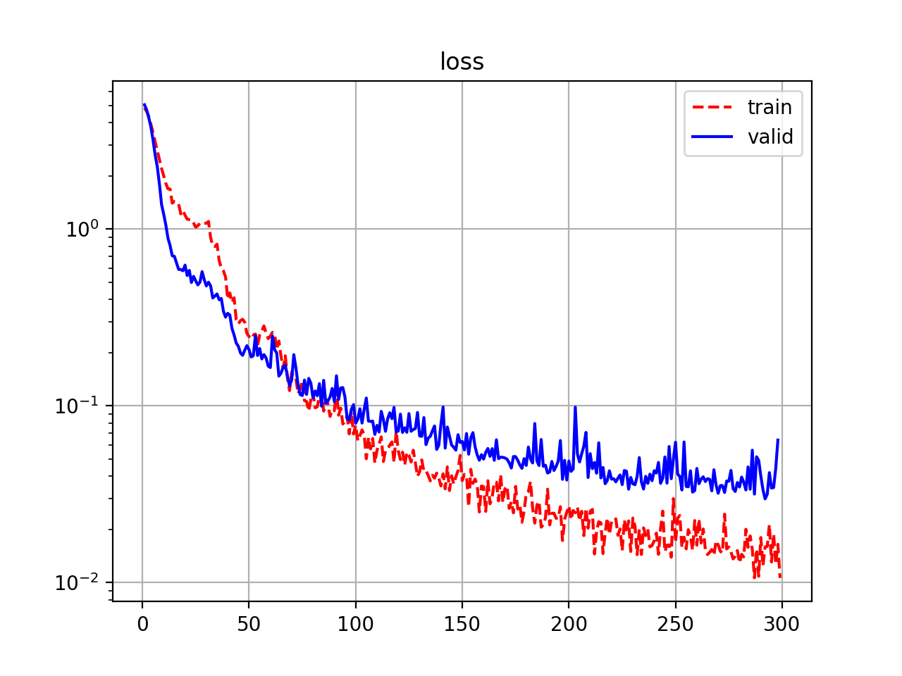
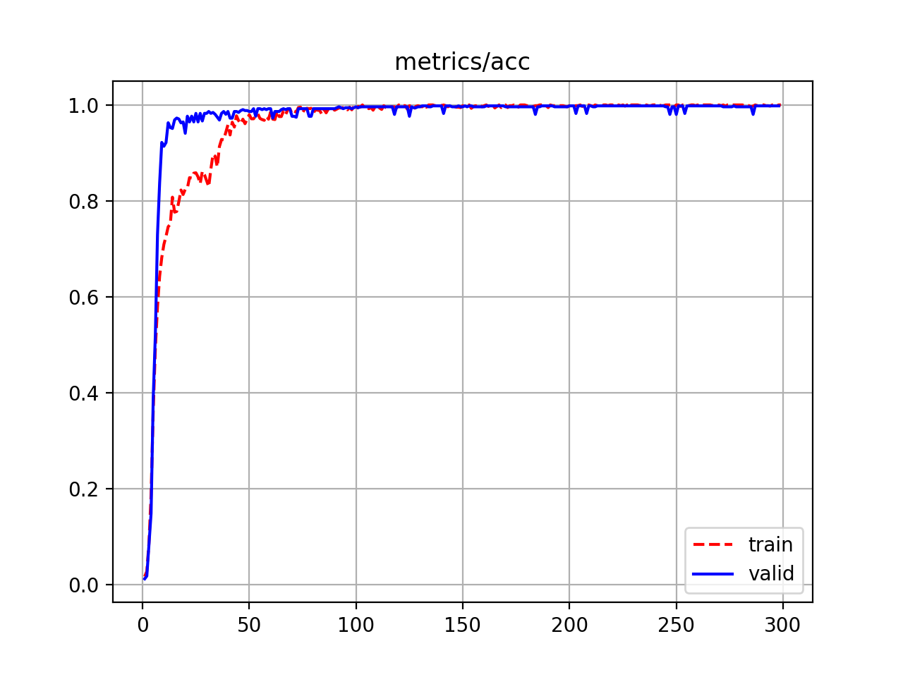
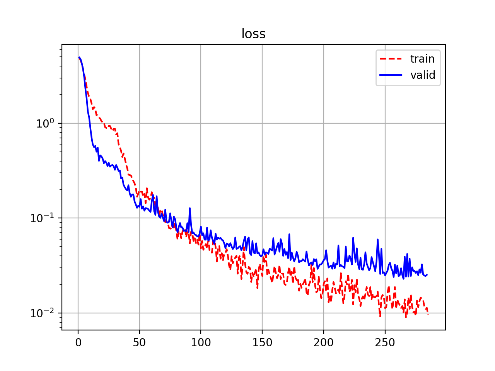
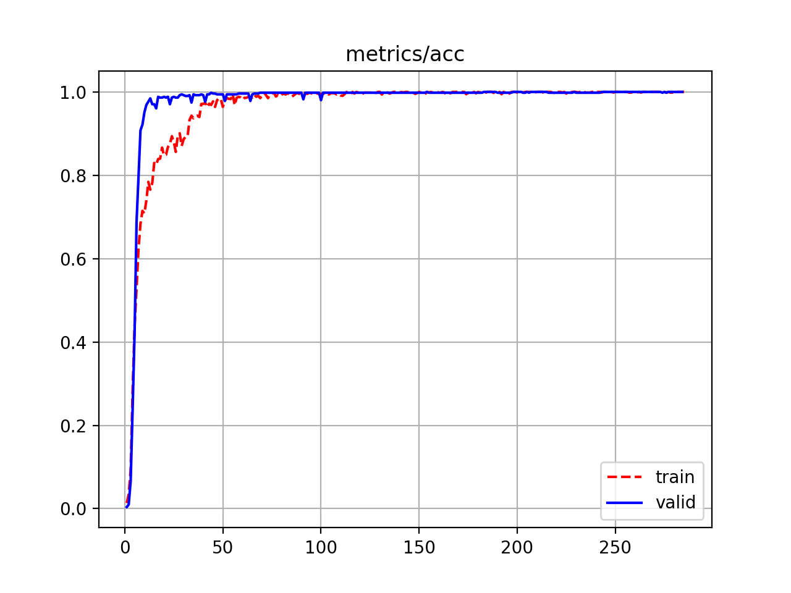

# Iris-Recognition-PyTorch
An end-to-end Iris Recognition using PyTorch.


## Installation

* Prepare tools for setup virtual environment (If you have already done, skip it):
```
sudo apt-get install -y python-pip python3-pip cmake
mkdir ~/.virtualenvs
cd ~/.virtualenvs
sudo pip install virtualenv virtualenvwrapper
sudo pip3 install virtualenv virtualenvwrapper
echo "# virtualenv and virtualenvwrapper" >> ~/.bashrc
echo "export WORKON_HOME=$HOME/.virtualenvs" >> ~/.bashrc
echo "export VIRTUALENVWRAPPER_PYTHON=/usr/bin/python3" >> ~/.bashrc
echo "source /usr/local/bin/virtualenvwrapper.sh" >> ~/.bashrc
source ~/.bashrc
```

* Create a new virtual environment, named *iris*:
```
virtualenv -p python3.6 iris
workon iris
```

* Clone git and install required packages:
```
git clone --recursive https://github.com/thuyngch/Iris-Recognition-PyTorch.git
cd Iris-Recognition-PyTorch
git submodule sync
git submodule update --init --recursive
pip install -r requirements.txt
```

* In this repository, I adapt off-the-shelf models from [pytorch-image-models](https://github.com/rwightman/pytorch-image-models), to install it:
```
pip install -e models/pytorch-image-models
```


## Training
* The used dataset is MMU2. Link for download from [Andy](https://www.cs.princeton.edu/~andyz/irisrecognition): https://www.cs.princeton.edu/~andyz/downloads/MMU2IrisDatabase.zip

* To start the training process, use the command:
```
python train.py --config config/mmu2_b0.json --device 0
```


## Results

* The model is [EfficientNet-b0/b1](https://arxiv.org/abs/1905.11946), trained by optimizer [SGDR](https://arxiv.org/abs/1608.03983) with 300 epochs: [config_efficientnet_b0](config/mmu2_b0.json), [config_efficientnet_b1](config/mmu2_b1.json).


* Loss and accuracy is summarized and plotted as follows:
  
|                 | Loss (train/valid) | Accuracy (train/valid) |
|-----------------|--------------------|------------------------|
| EfficientNet-b0 |    0.0105/0.0288   |      1.0000/0.9980     |
| EfficientNet-b1 |    0.0093/0.0202   |      1.0000/1.0000     |

<p align="center">
  
  
  <br>
  <em>Loss and Accuracy curve of EfficientNet-b0</em>
</p>

<p align="center">
  
  
  <br>
  <em>Loss and Accuracy curve of EfficientNet-b1</em>
</p>

* Download trained weight:
```
gdown https://drive.google.com/uc?id=18-4JLAEJGa1D4My2mky4Co0WU1eDPq6X&export=download # efficientnet_b0
gdown https://drive.google.com/uc?id=10sOieImsvre4msafbr07F_hdN_o6Pj0p&export=download # efficientnet_b1
```

* To ensure the trained model focuses on iris region inside images, I use [Grad-CAM](https://arxiv.org/abs/1610.02391) to visualize attention of the last feature layer (right before Global Average Pooling). To visualize heatmap, use this command:
```
python visualize.py --image /home/thuyngch/datasets/Iris/MMU2/010105.bmp \
                    --config config/mmu2_b0.json \
                    --weight /home/thuyngch/checkpoints/model_best.pth \
                    --use-cuda
```

<p align="center">
  
</p>
