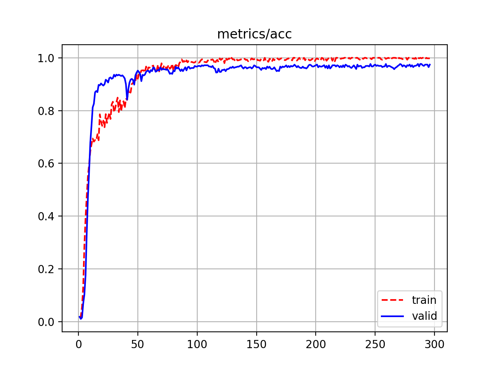

# Iris-Recognition-PyTorch
An end-to-end Iris Recognition using PyTorch.


## Installation

* Prepare tools for setup virtual environment (If you have already done, skip it):
```
sudo apt-get install -y python-pip python3-pip cmake
mkdir ~/.virtualenvs
cd ~/.virtualenvs
sudo pip install virtualenv virtualenvwrapper
sudo pip3 install virtualenv virtualenvwrapper
echo "# virtualenv and virtualenvwrapper" >> ~/.bashrc
echo "export WORKON_HOME=$HOME/.virtualenvs" >> ~/.bashrc
echo "export VIRTUALENVWRAPPER_PYTHON=/usr/bin/python3" >> ~/.bashrc
echo "source /usr/local/bin/virtualenvwrapper.sh" >> ~/.bashrc
source ~/.bashrc
```

* Create a new virtual environment, named *iris*:
```
virtualenv -p python3.6 iris
workon iris
```

* Clone git and install required packages:
```
git clone --recursive https://github.com/thuyngch/Iris-Recognition-PyTorch.git
cd Iris-Recognition-PyTorch
git submodule sync
git submodule update --init --recursive
pip install -r requirements.txt
```

* In this repository, I adapt off-the-shelf models from [pytorch-image-models](https://github.com/rwightman/pytorch-image-models), to install it:
```
pip install -e models/pytorch-image-models
```


## Training
* The used datasets are [MMU2](https://www.cs.princeton.edu/~andyz/irisrecognition) and [CASIA1](https://github.com/thuyngch/Iris-Recognition/tree/master/CASIA1). Each dataset is used independently.

* MMU2 dataset contains 995 images corresponding to 100 people. Each person was captured two eyes and each eye was captured 5 images (But one person is only captured one eye). In which, with each eye, 3 random images are selected for the training set and the rest belong to the testing set. Totally, the training size is 597, and the testing size is 398. List of training set and testing size can be found in [data/mmu2_train.txt](data/mmu2_train.txt) and [data/mmu2_valid.txt](data/mmu2_valid.txt)

* Meanwhile, CASIA1 dataset consists of 756 images corresponding to 108 people. Each person was also captured two eyes, the left one was captured 3 times, while the right one was captured 4 times. I randomly select 2/3 left-eye images and 2/2 right-eye images for the training set. In sum, the training size is 432, and the testing size is 324. List of training set and testing size can be found in [data/casia1_train.txt](data/casia1_train.txt) and [data/casia1_valid.txt](data/casia1_valid.txt)

|        | Train images | Test images |
|--------|--------------|-------------|
|  MMU2  |      597     |     398     |
| CASIA1 |      432     |     324     |

* Regarding the model, I refer [EfficientNet](https://arxiv.org/abs/1905.11946) with two variants b0 and b1. Models are trained by optimizer [SGDR](https://arxiv.org/abs/1608.03983) with 300 epochs.

* Config files can be found in the folder [configs](configs). To start the training process using EfficientNet-b0 on the MMU2 dataset with GPU0, use the command:
```
python train.py --config config/mmu2_b0.json --device 0
```


## Results

* Loss and accuracy on the MMU2 dataset are summarized and plotted as follows:

|                 | Loss (train/valid) | Accuracy (train/valid) |
|-----------------|--------------------|------------------------|
| EfficientNet-b0 |    0.0105/0.0288   |      1.0000/0.9980     |
| EfficientNet-b1 |    0.0093/0.0202   |      1.0000/1.0000     |

<p align="center">
  
  
  <br>
  <em>Loss and Accuracy curve of EfficientNet-b0 on the MMU2 dataset</em>
</p>

<p align="center">
  
  
  <br>
  <em>Loss and Accuracy curve of EfficientNet-b1 on the MMU2 dataset</em>
</p>

* Loss and accuracy on the CASIA1 dataset are summarized and plotted as follows:

|                 | Loss (train/valid) | Accuracy (train/valid) |
|-----------------|--------------------|------------------------|
| EfficientNet-b0 |    0.0269/0.1179   |      1.0000/0.9742     |
| EfficientNet-b1 |    0.0152/0.1457   |      0.9980/0.9766     |

<p align="center">
  
  
  <br>
  <em>Loss and Accuracy curve of EfficientNet-b0 on the CASIA1 dataset</em>
</p>

<p align="center">
  
  
  <br>
  <em>Loss and Accuracy curve of EfficientNet-b1 on the CASIA1 dataset</em>
</p>

* Download trained weight:
```
gdown https://drive.google.com/uc?id=18-4JLAEJGa1D4My2mky4Co0WU1eDPq6X&export=download # mmu2_b0
gdown https://drive.google.com/uc?id=10sOieImsvre4msafbr07F_hdN_o6Pj0p&export=download # mmu2_b1
```

* To ensure the trained model focuses on iris region inside images, I use [Grad-CAM](https://arxiv.org/abs/1610.02391) to visualize attention of the last feature layer (right before Global Average Pooling). To visualize heatmap, use this command:
```
python visualize.py --image /home/thuyngch/datasets/Iris/MMU2/010105.bmp \
                    --config config/mmu2_b0.json \
                    --weight /home/thuyngch/checkpoints/model_best.pth \
                    --use-cuda
```

<p align="center">
  
</p>
